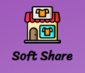
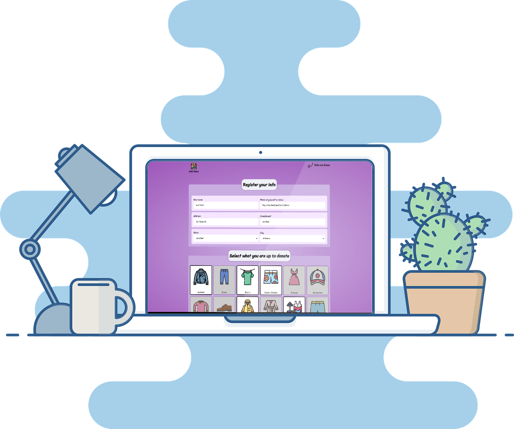

<h1 align="center">
  
</h1>

<h3 align="center">
  Web application to donate clothes
</h3>

<p align="center">Easy and fun way to share clothes and make good actions!</p>

<p align="center">
  

  <a href="https://www.linkedin.com/in/cassiogroh/" target="_blank" rel="noopener noreferrer">
    
  </a>

  

  <a href="https://github.com/cassiogroh/SoftShare/commits/master">
    
  </a>

  <a href="https://github.com/cassiogroh/SoftShare/issues">
    
  </a>

  
</p>

<p align="center">
  <a href="#%EF%B8%8F-about-the-project">About the project</a>&nbsp;&nbsp;&nbsp;|&nbsp;&nbsp;&nbsp;
  <a href="#-technologies">Technologies</a>&nbsp;&nbsp;&nbsp;|&nbsp;&nbsp;&nbsp;
  <a href="#-getting-started">Getting started</a>&nbsp;&nbsp;&nbsp;|&nbsp;&nbsp;&nbsp;
  <a href="#-how-to-contribute">How to contribute</a>&nbsp;&nbsp;&nbsp;|&nbsp;&nbsp;&nbsp;
  <a href="#-license">License</a>
</p>

<p align="center">
  
</p>

## 💇🏻‍♂️ About the project

This app provides a way to make people's lives merrier by donating clothes to those who need it or are just interested on what you no longer want.

 - Users can choose what they are up to donate upon registration.

 - People in need can easily find those who are donating by searching by their location, filtering by citis or states of the United States.

## 🚀 Technologies

Technologies used to develop frontend web
- [Node.js](https://nodejs.org/en/)
- [Express](https://expressjs.com/pt-br/)
- [Nunjucks](https://mozilla.github.io/nunjucks/)
- [Sqlite3](https://www.sqlite.org/index.html)
- [Nodemon](https://www.npmjs.com/package/nodemon)
- [US-cities-API](https://gist.github.com/cassiogroh/6b2b449a1e3774c08d752ec0fc9d7214)

## 💻 Getting started

### Requirements

- [Node.js](https://nodejs.org/en/)
- [Yarn](https://classic.yarnpkg.com/) or [npm](https://www.npmjs.com/)

**Clone the API project and access the folder**

```bash
$ git clone https://github.com/cassiogroh/SoftShare && cd SoftShare
```

**Follow the steps below**

```bash
# Install the dependencies
$ npm install

# Start the app
$ npm start dev:server

# Well done, project is running!

```


## 🤔 How to contribute

**Fork this repository**

```bash
# Fork using GitHub command line or trhough website

$ gh repo fork cassiogroh/SoftShare
```

**Follow the steps below**

```bash
# Clone your fork
$ git clone your-fork-url && cd SoftShare

# Create a branch with your feature
$ git checkout -b my-feature

# Make the commit with your changes
$ git commit -m 'feat: My new feature'

# Send the code to your remote branch
$ git push origin my-feature
```

After your pull request is merged, you can delete your branch

## 📝 License

This project is licensed under the MIT License - see the [LICENSE](LICENSE) file for details.

---

Made with 💜 &nbsp;by Cassio Groh 👋 &nbsp;[See my linkedin](https://www.linkedin.com/in/cassiogroh/)