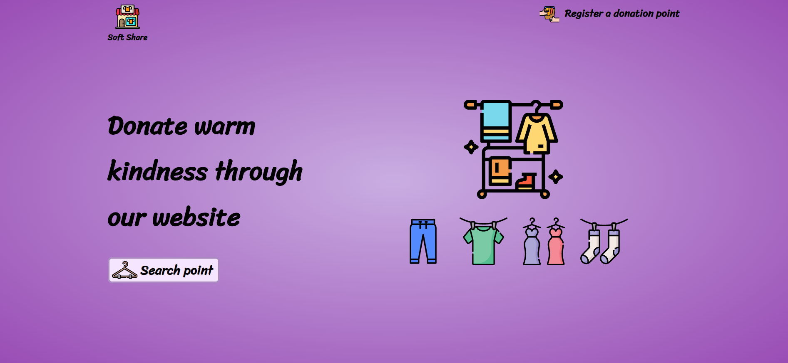
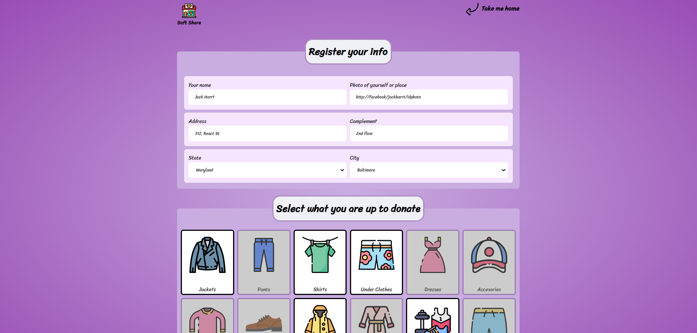
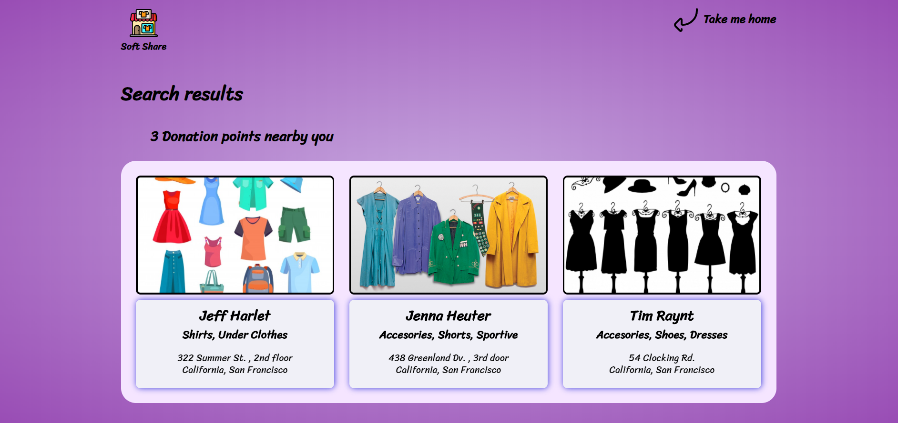

# Fictional web app to connect people who desire to help others by donating clothes
 

* Built to practice __front / backend__ skills when I first started studying __HTML / CSS / JS__;  

### Home screen

### Registration page

### Search results

**Clone this repo and `npm start` to check a __simple__ and __quick__ way to build web sites to help people**
